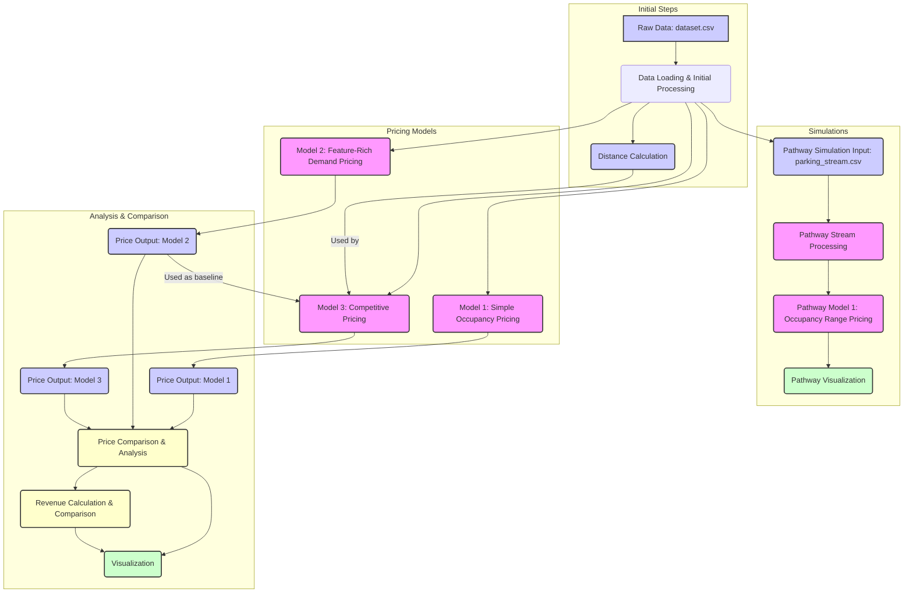

# Dynamic Pricing for Urban Parking Lots

## Introduction

This project focuses on analyzing and simulating various dynamic pricing models for parking lots. The primary goal is to understand how different factors and strategies influence pricing and revenue generation in a real-time parking environment. We explore three distinct models: a simple occupancy-based approach, a more sophisticated model incorporating multiple demand-related features, and a competitive pricing model that considers the prices of nearby parking facilities.

## Tech Stack

The project utilizes the following technologies and libraries:

*   **Python:** The primary programming language used for data analysis, model simulation, and visualization.
*   **pandas:** Used for data manipulation and analysis.
*   **NumPy:** Used for numerical operations, particularly in distance calculations.
*   **Bokeh:** Used for creating interactive visualizations of pricing trends.
*   **Pathway:** Used for simulating real-time data streams and dynamic pricing logic.
*   **Matplotlib:** Used for static data visualizations (though Bokeh was primarily used for interactive plots).

## Architecture and Workflow

The project's architecture and workflow can be visualized using the following diagram:



**Workflow Description:**

1.  **Data Loading & Initial Processing:** The process begins by loading the raw parking data from `dataset.csv` into a pandas DataFrame. This includes parsing timestamps and performing any necessary initial data cleaning or preparation.
2.  **Distance Calculation:** Distances between unique parking lots are calculated using the Haversine formula to support the competitive pricing model.
3.  **Pricing Model Simulation:**
    *   **Model 1 (Simple Occupancy Pricing):** Prices are calculated based directly on the occupancy ratio of each parking lot.
    *   **Model 2 (Feature-Rich Demand Pricing):** A more complex demand score is calculated using occupancy, queue length, traffic conditions, special day status, and vehicle type. Prices are then derived from this normalized demand score.
    *   **Model 3 (Competitive Pricing):** Building on Model 2's output as a baseline, this model adjusts prices based on the average prices of nearby competing parking lots within a defined radius.
4.  **Price Output & Comparison:** The calculated prices from all three models are consolidated into a single DataFrame.
5.  **Analysis & Visualization:** Summary statistics, price differences, and correlations between features and prices are analyzed. Interactive plots using Bokeh are generated to visualize price trends over time for different parking lots and compare the price distributions of the models.
6.  **Revenue Calculation & Comparison:** Simulated revenue for each model is calculated by multiplying the generated price by the reported occupancy. Total and average revenues are compared to evaluate the economic performance of each model.
7. **Pathway Simulation:** A separate simulation is performed using Pathway to process a data stream based on `parking_stream.csv`. This demonstrates a real-time data processing approach for a simplified occupancy-based model and visualizes its output.
analyzed. Interactive plots using Bokeh are generated to visualize price trends over time for different parking lots and compare the price distributions of the models.
6.  **Revenue Calculation & Comparison:** Simulated revenue for each model is calculated by multiplying the generated price by the reported occupancy. Total and average revenues are compared to evaluate the economic performance of each model.
7. **Pathway Simulation:** A separate simulation is performed using Pathway to process a data stream based on `parking_stream.csv`. This demonstrates a real-time data processing approach for a simplified occupancy-based model and visualizes its output.

## How to Run

1.  Clone this repository.
2.  Ensure you have Python installed.
3.  Install the required libraries:
    ```bash
    pip install pandas numpy bokeh pathway matplotlib
    ```
4.  Download the `dataset.csv` file and place it in the project directory.
5.  Run the Jupyter Notebook `Parking_Pricing_Models_Analysis.ipynb` to execute the data analysis, model simulations, and generate visualizations.

## Conclusion

This project provides a comparative analysis of different dynamic parking pricing models, highlighting the trade-offs between model complexity, pricing dynamics, and revenue generation. The simulations and visualizations offer insights into how real-time data and competitive factors can be leveraged to optimize parking prices.

